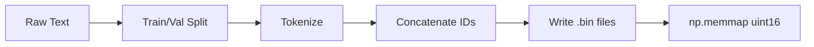

# Data Preparation

# Data Preparation Module

## Overview

The Data Preparation module converts raw text datasets into memory-mapped binary files (`train.bin`, `val.bin`) containing token IDs stored as `np.uint16`. These binary files are consumed at training time for efficient random access without loading the entire dataset into memory.

All three preparation scripts share the same output contract: token ID arrays written via `np.memmap` or `np.ndarray.tofile`, readable later as:

```python
m = np.memmap('train.bin', dtype=np.uint16, mode='r')
```

## Datasets

| Script | Dataset | Tokenizer | Vocab Size | Train Tokens | Val Tokens |
|---|---|---|---|---|---|
| `data/openwebtext/prepare.py` | OpenWebText (HuggingFace) | GPT-2 BPE (`tiktoken`) | 50,257 | ~9B | ~4M |
| `data/shakespeare/prepare.py` | Tiny Shakespeare | GPT-2 BPE (`tiktoken`) | 50,257 | 301,966 | 36,059 |
| `data/shakespeare_char/prepare.py` | Tiny Shakespeare | Character-level | 65 | 1,003,854 | 111,540 |

## Pipeline



Each script follows the same four stages: **load → split → tokenize → serialize**. The key difference is how tokenization is performed and how the data is sourced.

---

## OpenWebText — `data/openwebtext/prepare.py`

Prepares the full OpenWebText corpus for BPE-level language modeling. This is the production-scale dataset (~9B tokens, ~17GB on disk).

### Data Loading

Uses HuggingFace `datasets.load_dataset("openwebtext")` with multi-process loading (`num_proc_load_dataset = 8`). The dataset downloads ~54GB into the HuggingFace cache directory and contains ~8M documents.

### Train/Val Split

OpenWebText ships with only a `train` split. The script creates a validation set by calling:

```python
split_dataset = dataset["train"].train_test_split(test_size=0.0005, seed=2357, shuffle=True)
split_dataset['val'] = split_dataset.pop('test')
```

This yields ~8,009,762 training rows and ~4,007 validation rows.

### Tokenization

Each document is tokenized with `tiktoken.get_encoding("gpt2")` using `encode_ordinary`, which ignores special tokens. An end-of-text token (`enc.eot_token`, value 50256) is **appended** to each document:

```python
def process(example):
    ids = enc.encode_ordinary(example['text'])
    ids.append(enc.eot_token)  # 50256
    return {'ids': ids, 'len': len(ids)}
```

The `process` function is applied via `split_dataset.map()` with `num_proc=8` and `remove_columns=['text']`.

### Serialization

All token IDs for each split are concatenated into a single flat array and written to a memory-mapped file:

1. Compute total length: `arr_len = np.sum(dset['len'], dtype=np.uint64)`
2. Create a `np.memmap` with `dtype=np.uint16` and `mode='w+'`
3. Shard the dataset into 1024 contiguous batches, convert each to numpy, and write into the memmap
4. Call `arr.flush()` to persist to disk

The `uint16` dtype is valid because `enc.max_token_value == 50256 < 2**16`.

**Output files:** `train.bin` (~17GB), `val.bin` (~8.5MB)

### Concurrency Tuning

Two parallelism knobs are exposed at the top of the script:

- `num_proc` — worker count for `.map()` tokenization. Rule of thumb: `cpu_cores // 2`.
- `num_proc_load_dataset` — worker count for `load_dataset()`. May differ from `num_proc` depending on network throughput.

---

## Shakespeare (BPE) — `data/shakespeare/prepare.py`

A minimal script for the Tiny Shakespeare dataset, tokenized with the same GPT-2 BPE encoder. Useful for debugging and rapid iteration.

### Data Loading

Downloads `input.txt` from the char-rnn repository if not already present:

```python
data_url = 'https://raw.githubusercontent.com/karpathy/char-rnn/master/data/tinyshakespeare/input.txt'
```

### Train/Val Split

Simple 90/10 character-position split (no shuffling):

```python
train_data = data[:int(n*0.9)]
val_data = data[int(n*0.9):]
```

### Tokenization & Serialization

Encodes with `enc.encode_ordinary()`, converts to `np.uint16`, and writes with `np.ndarray.tofile()`. No EOT token is appended between documents (the entire text is treated as one continuous sequence).

**Output files:** `train.bin`, `val.bin`

---

## Shakespeare (Character-Level) — `data/shakespeare_char/prepare.py`

Prepares Tiny Shakespeare for character-level modeling. Instead of BPE, each unique character maps to a unique integer.

### Vocabulary Construction

The script builds the vocabulary from the data itself:

```python
chars = sorted(list(set(data)))
vocab_size = len(chars)  # 65
stoi = {ch: i for i, ch in enumerate(chars)}
itos = {i: ch for i, ch in enumerate(chars)}
```

The 65-character vocabulary includes letters, digits, punctuation, and whitespace.

### Metadata Export

Unlike the BPE scripts, this script saves a `meta.pkl` file alongside the binary data:

```python
meta = {
    'vocab_size': vocab_size,
    'itos': itos,
    'stoi': stoi,
}
```

This metadata is required at inference time to decode predictions back to characters, since the mapping is dataset-specific rather than a standard tokenizer.

**Output files:** `train.bin`, `val.bin`, `meta.pkl`

---

## Binary File Format

All scripts produce the same on-disk format:

- **Type:** Raw numpy array, little-endian `uint16`
- **Layout:** Flat 1D array of token IDs, no headers or padding
- **Reading:** `np.memmap(path, dtype=np.uint16, mode='r')`

The `uint16` choice works because all three tokenizers produce IDs below 65536. For the GPT-2 BPE encoder, the maximum value is 50256 (the EOT token). For character-level Shakespeare, the maximum is 64.

### EOT Token Handling

| Script | EOT Between Documents |
|---|---|
| `openwebtext/prepare.py` | Yes — appended after each document |
| `shakespeare/prepare.py` | No — single continuous stream |
| `shakespeare_char/prepare.py` | No — single continuous stream |

This distinction matters for the training data loader: when documents are separated by EOT tokens, the loader can respect document boundaries when constructing training sequences. When they are not, the loader treats the entire file as one unbroken stream.

---

## Adding a New Dataset

To prepare a new dataset, follow this checklist:

1. Create a new directory under `data/<dataset_name>/`
2. Implement `prepare.py` following the shared pattern:
   - Load or download raw text
   - Split into train and validation sets
   - Tokenize (choose BPE via `tiktoken` or a custom scheme)
   - Write `train.bin` and `val.bin` as flat `np.uint16` arrays
   - If using a custom vocabulary, write `meta.pkl` with `vocab_size`, `stoi`, and `itos`
3. Ensure all token IDs fit in `uint16` (max 65535)
4. Decide whether to insert EOT tokens between documents and document this choice