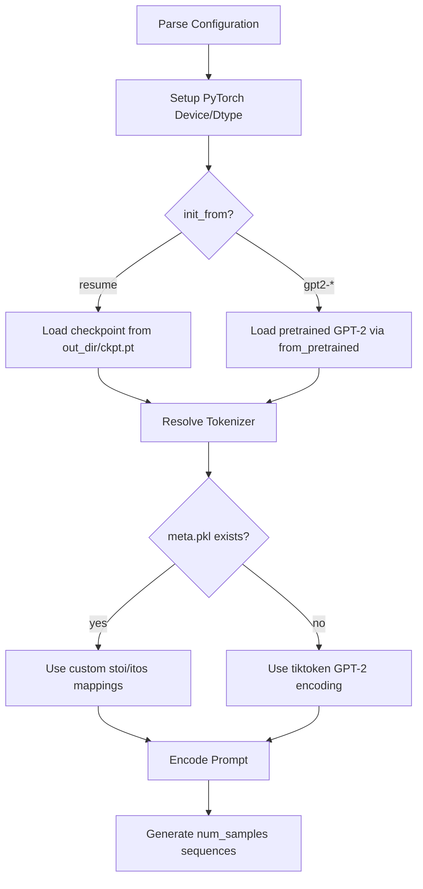

# Inference

# Inference Module

## Overview

`sample.py` is the standalone inference script for generating text from a trained GPT model. It handles model loading, tokenizer resolution, prompt encoding, and autoregressive sampling with configurable temperature and top-k filtering.

## Execution Flow

## Configuration

All configuration is defined as module-level variables at the top of the script. Values can be overridden at runtime via `configurator.py`, which is executed with `exec(open('configurator.py').read())`. This allows command-line or config-file overrides without modifying the script itself.

| Variable | Default | Description |
|---|---|---|
| `init_from` | `'resume'` | Model source: `'resume'` loads from a checkpoint directory, or a GPT-2 variant name (e.g. `'gpt2-xl'`) loads pretrained weights |
| `out_dir` | `'out'` | Directory containing `ckpt.pt` (only used when `init_from='resume'`) |
| `start` | `"\n"` | Prompt string. Prefix with `FILE:` to load from a file (e.g. `"FILE:prompt.txt"`) |
| `num_samples` | `10` | Number of independent samples to generate |
| `max_new_tokens` | `500` | Maximum tokens generated per sample (beyond the prompt) |
| `temperature` | `0.8` | Sampling temperature. `1.0` = no change, `< 1.0` = less random, `> 1.0` = more random |
| `top_k` | `200` | Top-k filtering. Only the k most likely tokens are considered; others are zeroed out |
| `seed` | `1337` | Random seed for reproducibility |
| `device` | `'cuda'` | Compute device (`'cpu'`, `'cuda'`, `'cuda:0'`, etc.) |
| `dtype` | auto | Floating point dtype. Auto-selects `bfloat16` if supported, otherwise `float16` |
| `compile` | `False` | Whether to apply `torch.compile` for PyTorch 2.0 acceleration |

## Model Loading

Two initialization paths are supported:

### Resume from Checkpoint (`init_from='resume'`)

Loads a training checkpoint from `{out_dir}/ckpt.pt`. The checkpoint must contain:

- **`model_args`**: Dictionary of arguments passed to `GPTConfig` to reconstruct the model architecture.
- **`model`**: The model `state_dict`.

The script strips the `_orig_mod.` prefix from state dict keys, which is an artifact of `torch.compile`. This ensures compatibility whether the saved model was compiled or not.

### Pretrained GPT-2 (`init_from='gpt2'`, `'gpt2-xl'`, etc.)

Loads a pretrained GPT-2 model using `GPT.from_pretrained()`, with dropout set to 0.0 for deterministic inference. This path does not require a local checkpoint.

## Tokenizer Resolution

The tokenizer is resolved based on the model source and available metadata:

1. **Custom tokenizer** — If `init_from='resume'` and the checkpoint contains `config.dataset`, the script looks for `data/{dataset}/meta.pkl`. This file must contain `stoi` (string-to-index) and `itos` (index-to-string) mappings, typically for character-level or custom BPE tokenizers.

2. **GPT-2 tokenizer (fallback)** — If no `meta.pkl` is found, or when loading a pretrained GPT-2 model, the script uses `tiktoken` with the `"gpt2"` encoding. The special token `<|endoftext|>` is registered as an allowed special token.

The resolved `encode` and `decode` lambdas are used throughout the generation loop.

## Prompt Encoding

The `start` variable supports two modes:

- **Direct string**: `start = "Once upon a time"` — the string is encoded directly.
- **File reference**: `start = "FILE:prompt.txt"` — the `FILE:` prefix is stripped and the file contents are read as the prompt string.

The encoded prompt is converted to a tensor of shape `[1, seq_len]` for batch dimension compatibility with `model.generate()`.

## Generation Loop

Generation runs inside `torch.no_grad()` and the configured autocast context manager (mixed precision on CUDA, no-op on CPU). For each of `num_samples` iterations:

1. `model.generate(x, max_new_tokens, temperature=temperature, top_k=top_k)` produces a tensor of shape `[1, prompt_len + max_new_tokens]`.
2. The output tokens are decoded to a string and printed.
3. Samples are separated by `---------------`.

Note that each sample starts from the **same** prompt tensor `x` — the model state is not carried between iterations.

## Hardware and Performance Setup

The script configures several PyTorch performance options:

- **Seeding**: Both `torch.manual_seed` and `torch.cuda.manual_seed` are set for reproducibility.
- **TF32**: Enabled for both `matmul` and `cudnn` operations on Ampere+ GPUs for faster matmuls with minimal accuracy loss.
- **Autocast**: Uses `torch.amp.autocast` with the selected dtype on CUDA; falls back to `nullcontext` on CPU.
- **Compilation**: When `compile=True`, `torch.compile` is applied to the model after loading and before generation.

## Dependencies

- `model.GPTConfig` and `model.GPT` — the model implementation being inferred from.
- `tiktoken` — GPT-2 tokenizer (used as fallback).
- `configurator.py` — runtime configuration overrides (executed via `exec`).
- `pickle` — for loading custom tokenizer metadata from `meta.pkl`.