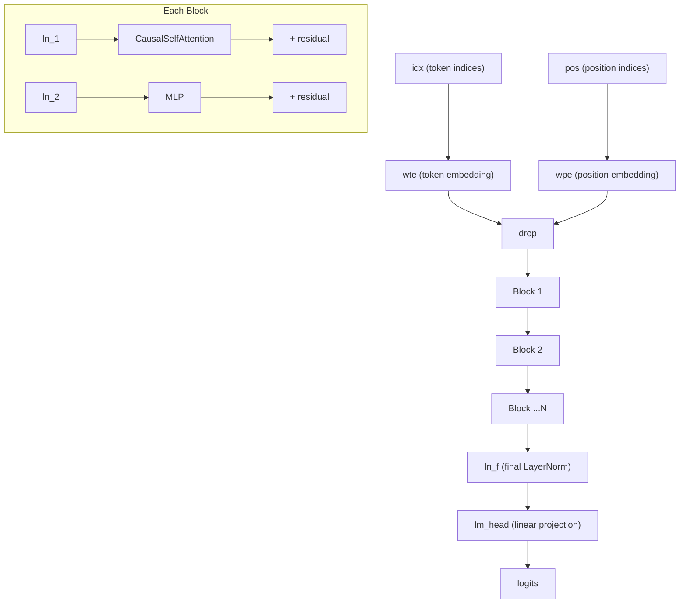

# Model Architecture

# Model Architecture

A from-scratch PyTorch implementation of the GPT-2 language model. The module defines the full network — from configuration through tokenization-agnostic token/position embeddings, transformer blocks, and a language modeling head — in a single file. It supports both training from scratch and loading pretrained GPT-2 weights from HuggingFace.

## Architecture Overview



The model follows the pre-norm transformer variant: LayerNorm is applied *before* each sub-layer (attention, MLP), and the sub-layer output is added back via a residual connection. This differs from the original GPT-2 post-norm design but matches modern best practice.

## Configuration

`GPTConfig` is a `@dataclass` controlling all model dimensions and hyperparameters:

| Field | Default | Description |
|---|---|---|
| `block_size` | 1024 | Maximum sequence length (context window) |
| `vocab_size` | 50304 | Vocabulary size. Padded to a multiple of 64 for hardware efficiency (GPT-2's 50257 + padding) |
| `n_layer` | 12 | Number of transformer `Block` layers |
| `n_head` | 12 | Number of attention heads per layer |
| `n_embd` | 768 | Embedding / hidden dimension |
| `dropout` | 0.0 | Dropout rate applied to attention weights, residuals, and embeddings |
| `bias` | `True` | Whether to include bias terms in `nn.Linear` and `LayerNorm`. `False` is slightly faster and often equally effective |

The defaults correspond to the GPT-2 Small (124M parameter) configuration.

## Core Components

### LayerNorm

A thin wrapper around `F.layer_norm` that supports an optional bias parameter. PyTorch's built-in `nn.LayerNorm` always includes bias; this version allows `bias=None` when `config.bias` is `False`, saving a small number of parameters.

### CausalSelfAttention

Multi-head causal (autoregressive) self-attention with two execution paths:

- **Flash Attention** (default when PyTorch ≥ 2.0): Delegates to `F.scaled_dot_product_attention` with `is_causal=True`. This uses fused CUDA kernels for significant speedup.
- **Manual fallback**: Computes scaled dot-product attention explicitly, applying a lower-triangular causal mask stored as a registered buffer (`self.bias`). Used when Flash Attention is unavailable.

**Projection structure:**
- `c_attn`: Single linear layer projecting input to concatenated Q, K, V (`3 * n_embd`), then split along the last dimension.
- `c_proj`: Output projection back to `n_embd`.

**Shape flow** (per head dimension `hs = n_embd // n_head`):
```
input:  (B, T, n_embd)
  → c_attn → split → (q, k, v) each (B, T, n_embd)
  → reshape → (B, n_head, T, hs)
  → attention → (B, n_head, T, hs)
  → transpose + contiguous → (B, T, n_embd)
  → c_proj → (B, T, n_embd)
```

Dropout is applied to both attention weights (`attn_dropout`) and the output projection (`resid_dropout`).

### MLP

Standard position-wise feed-forward network with a 4× expansion factor:

```
input → Linear(n_embd, 4*n_embd) → GELU → Linear(4*n_embd, n_embd) → Dropout
```

The GELU activation matches the GPT-2 paper. The 4× expansion ratio is fixed and not configurable.

### Block

A single transformer block implementing pre-norm residual connections:

```python
x = x + self.attn(self.ln_1(x))
x = x + self.mlp(self.ln_2(x))
```

LayerNorm is applied *before* the sub-layer, and the sub-layer output is added to the unmodified input. This is the pre-norm formulation, which stabilizes training for deep networks.

## GPT Model

### Initialization and Weight Tying

**Weight initialization** follows the GPT-2 convention:
- All `nn.Linear` weights: `N(0, 0.02)`
- All `nn.Linear` biases: `0`
- All `nn.Embedding` weights: `N(0, 0.02)`
- **Residual projection scaling**: Any parameter named `c_proj.weight` is initialized with `N(0, 0.02 / sqrt(2 * n_layer))`. This compensates for the variance accumulation across residual additions as described in the GPT-2 paper.

**Weight tying**: `self.transformer.wte.weight` and `self.lm_head.weight` share the same parameter tensor. The token embedding matrix doubles as the output projection, reducing parameter count and tying input/output representations. Note: `torch.compile()` may emit a deprecation warning about multiple values for tied weights; this is currently harmless.

### Forward Pass

```python
logits, loss = model(idx, targets=None)
```

- **`idx`**: `(B, T)` LongTensor of token indices.
- **`targets`**: `(B, T)` LongTensor of target token indices, or `None` for inference.

**Training path** (`targets` provided):
1. Look up token embeddings (`wte`) and position embeddings (`wpe`), sum them, apply dropout.
2. Pass through all `Block` layers sequentially.
3. Apply final LayerNorm (`ln_f`).
4. Project all positions through `lm_head` to get logits over the full sequence.
5. Compute cross-entropy loss with `ignore_index=-1` (allows masking specific target positions).

**Inference path** (`targets` is `None`):
Same as training through step 3, but `lm_head` is only applied to the **last position** (`x[:, [-1], :]`), avoiding unnecessary computation for non-final tokens. The `[-1]` indexing (list, not integer) preserves the time dimension.

### Loading Pretrained Weights

```python
model = GPT.from_pretrained('gpt2', override_args={'dropout': 0.1})
```

Supported model types: `gpt2`, `gpt2-medium`, `gpt2-large`, `gpt2-xl`.

The method:
1. Creates a fresh `GPT` with the architecture matching the specified model type.
2. Loads the corresponding `GPT2LMHeadModel` from HuggingFace `transformers`.
3. Copies weights, **transposing** any `Conv1D`-style weights (the HuggingFace GPT-2 implementation uses `Conv1D` instead of `nn.Linear`, which stores weights transposed). The affected layers are: `attn.c_attn.weight`, `attn.c_proj.weight`, `mlp.c_fc.weight`, `mlp.c_proj.weight`.
4. Only `dropout` can be overridden; all other architectural parameters are locked to the checkpoint values (`vocab_size=50257`, `block_size=1024`, `bias=True`).

### Optimizer Configuration

```python
optimizer = model.configure_optimizers(weight_decay=0.1, learning_rate=3e-4, betas=(0.9, 0.95), device_type='cuda')
```

Parameters are split into two groups based on dimensionality:
- **2D+ tensors** (weight matrices, embeddings): receive the specified `weight_decay`.
- **1D tensors** (biases, LayerNorm parameters): have `weight_decay=0.0`.

This avoids decaying bias and normalization parameters, which is standard practice. On CUDA, the fused AdamW implementation is used automatically when available.

### Generation

```python
output = model.generate(idx, max_new_tokens=100, temperature=0.8, top_k=40)
```

Autoregressive token generation loop:
1. Crop the input to the last `block_size` tokens if it exceeds the context window.
2. Forward pass to get logits for the last position.
3. Apply temperature scaling: `logits /= temperature`.
4. Optionally apply top-k filtering: set logits below the k-th highest value to `-inf`.
5. Sample from the resulting distribution via `torch.multinomial`.
6. Append the sampled token and repeat.

The method is decorated with `@torch.no_grad()`. Callers should ensure the model is in `eval()` mode for deterministic behavior of dropout layers.

### Utility Methods

**`crop_block_size(block_size)`**: Truncates the model to a shorter context window. Surgically resizes the position embedding table and the causal attention mask buffer. Useful when loading a 1024-token pretrained checkpoint but training/evaluating with a shorter sequence length.

**`get_num_params(non_embedding=True)`**: Returns the parameter count. By default excludes position embeddings (since they're a fixed overhead), but includes token embeddings because they're tied with `lm_head` and actively used in the output computation.

**`estimate_mfu(fwdbwd_per_iter, dt)`**: Estimates Model FLOPs Utilization as a fraction of A100 bfloat16 peak throughput (312 TFLOPS). Uses the approximation from the PaLM paper (Appendix B): `flops_per_token = 6*N + 12*L*H*Q*T`, where N is the non-embedding parameter count, L is layers, H is heads, Q is head dimension, and T is sequence length.

## Design Decisions

- **Pre-norm over post-norm**: More stable training for deep networks; matches modern transformer practice rather than the original GPT-2 paper.
- **Optional bias**: Setting `config.bias=False` removes bias from all `nn.Linear` and `LayerNorm` layers, which is slightly faster and often equally effective (following PaLM and LLaMA).
- **Vocab size padding**: 50304 (nearest multiple of 64 above GPT-2's 50257) ensures GPU-friendly tensor shapes without changing model semantics.
- **Flash Attention auto-detection**: The model checks for `F.scaled_dot_product_attention` at construction time and falls back gracefully with a warning if unavailable.