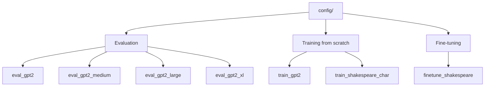

# Other — config

# Config Module

Configuration files that define hyperparameters, evaluation settings, and runtime behavior for GPT-2 training, fine-tuning, and evaluation runs. Each file is a standalone Python script that sets module-level variables consumed by the main training loop.

## Overview

The config files follow a simple convention: they declare plain Python variables at module scope. The training script (`train.py`) loads a config by passing its path as a command-line argument, then merges those variables into the runtime configuration object. This approach avoids rigid config schemas — any variable present in the config overrides the default.

```bash
# Example usage
torchrun --standalone --nproc_per_node=8 train.py config/train_gpt2.py
python train.py config/train_shakespeare_char.py
```

## Config Categories

The configs fall into three categories based on their purpose:



### Evaluation Configs

Four configs for evaluating pretrained GPT-2 weights at each model scale. All share the same structure — they differ only in the `init_from` value, which selects which HuggingFace checkpoint to load.

| Config | `init_from` | Parameters | Architecture |
|---|---|---|---|
| `eval_gpt2` | `gpt2` | 124M | 12 layers, 12 heads, 768 embed |
| `eval_gpt2_medium` | `gpt2-medium` | 350M | 24 layers, 16 heads, 1024 embed |
| `eval_gpt2_large` | `gpt2-large` | 774M | 36 layers, 20 heads, 1280 embed |
| `eval_gpt2_xl` | `gpt2-xl` | 1558M | 48 layers, 25 heads, 1600 embed |

Common settings across all evaluation configs:

- `batch_size = 8` — evaluation batch size
- `eval_iters = 500` — number of iterations for loss estimation (higher than training for accuracy)
- `eval_only = True` — skip training, only run evaluation
- `wandb_log = False` — disable W&B logging for pure eval runs

### Training Configs

#### `train_gpt2.py`

Full-scale training of GPT-2 (124M) from scratch on OpenWebText. Designed for a single 8×A100 40GB node, reaching ~2.85 validation loss over approximately 5 days.

Key design decisions:

- **Total batch size ~0.5M tokens**: `12 batch_size × 1024 block_size × 40 gradient_accumulation_steps (5×8 GPUs) = 491,520 tokens/step`
- **300B total training tokens**: `600,000 max_iters × ~0.5M tokens/iter`
- **Weight decay**: `1e-1` for regularization
- **W&B logging enabled**: project `owt`, run name `gpt2-124M`

Launch command:
```bash
torchrun --standalone --nproc_per_node=8 train.py config/train_gpt2.py
```

#### `train_shakespeare_char.py`

A miniature character-level model for debugging and development on resource-constrained hardware (e.g., MacBooks). Intentionally overfits the small Shakespeare dataset.

Architecture is a "baby GPT":

- `n_layer = 6`, `n_head = 6`, `n_embd = 384`
- `dropout = 0.2` — higher than typical since the model easily overfits
- `block_size = 256` — shorter context (characters, not subwords)
- `batch_size = 64`, `gradient_accumulation_steps = 1`

Training specifics:

- `learning_rate = 1e-3` — higher LR affordable with small networks
- `min_lr = 1e-4` — floor for LR decay (typically `learning_rate / 10`)
- `beta2 = 0.99` — slightly higher than default 0.999... wait, actually 0.99 is lower. This is adjusted because the number of tokens per iteration is small, making gradient estimates noisier; a lower beta2 means the optimizer adapts faster.
- `warmup_iters = 100` — short warmup, noted as potentially unnecessary
- `always_save_checkpoint = False` — only persist when validation loss improves, since overfitting is expected

For CPU-only runs, uncomment or add:
```python
device = 'cpu'
compile = False
```

### Fine-tuning Config

#### `finetune_shakespeare.py`

Fine-tunes GPT-2 XL (1558M) on the Shakespeare dataset. Uses a constant learning rate with no decay, which is standard practice for fine-tuning.

Key settings:

- `init_from = 'gpt2-xl'` — start from the largest pretrained GPT-2
- `learning_rate = 3e-5` — much lower than from-scratch training
- `decay_lr = False` — constant LR throughout fine-tuning
- `always_save_checkpoint = False` — only save on validation improvement
- `max_iters = 20` — very few steps needed (dataset is ~302K tokens; at 32,768 tokens/iter, one epoch ≈ 9.2 iters)
- `batch_size = 1`, `gradient_accumulation_steps = 32` — effective batch of 32 sequences to fit large model in memory

## Common Variables Reference

These are the variables that the training script reads from config files. Not every config sets every variable — defaults are handled in the training code.

| Variable | Type | Description |
|---|---|---|
| `init_from` | `str` | Checkpoint source: `'gpt2'`, `'gpt2-medium'`, `'gpt2-large'`, `'gpt2-xl'`, or a path |
| `batch_size` | `int` | Micro-batch size per GPU |
| `block_size` | `int` | Context length in tokens (or characters for char-level) |
| `gradient_accumulation_steps` | `int` | Steps to accumulate before weight update |
| `max_iters` | `int` | Total training iterations |
| `learning_rate` | `float` | Peak learning rate |
| `decay_lr` | `bool` | Whether to apply cosine LR decay |
| `lr_decay_iters` | `int` | Iterations over which LR decays |
| `min_lr` | `float` | Minimum LR after decay |
| `warmup_iters` | `int` | Linear warmup iterations |
| `beta2` | `float` | Adam beta2 parameter |
| `weight_decay` | `float` | AdamW weight decay |
| `dropout` | `float` | Residual dropout rate |
| `eval_interval` | `int` | Iterations between evaluations |
| `eval_iters` | `int` | Batches used for loss estimation |
| `eval_only` | `bool` | If True, run evaluation and exit |
| `always_save_checkpoint` | `bool` | If False, only save when val loss improves |
| `log_interval` | `int` | Iterations between training log prints |
| `out_dir` | `str` | Directory for checkpoints and logs |
| `dataset` | `str` | Dataset name (e.g., `'shakespeare'`, `'shakespeare_char'`) |
| `wandb_log` | `bool` | Enable Weights & Biases logging |
| `wandb_project` | `str` | W&B project name |
| `wandb_run_name` | `str` | W&B run identifier |
| `n_layer` | `int` | Number of transformer blocks |
| `n_head` | `int` | Number of attention heads |
| `n_embd` | `int` | Embedding dimension |
| `device` | `str` | Compute device (`'cpu'`, `'cuda'`) |
| `compile` | `bool` | Whether to `torch.compile` the model |

## Creating a Custom Config

To define a new run, create a Python file in `config/` and set only the variables you want to override:

```python
# config/my_experiment.py
out_dir = 'out-my-experiment'
dataset = 'openwebtext'
init_from = 'gpt2'  # start from pretrained

batch_size = 8
block_size = 1024
gradient_accumulation_steps = 4

learning_rate = 6e-4
max_iters = 100000
lr_decay_iters = 100000

eval_interval = 500
eval_iters = 200

wandb_log = True
wandb_project = 'my-project'
wandb_run_name = 'experiment-1'
```

Then run:
```bash
python train.py config/my_experiment.py
```