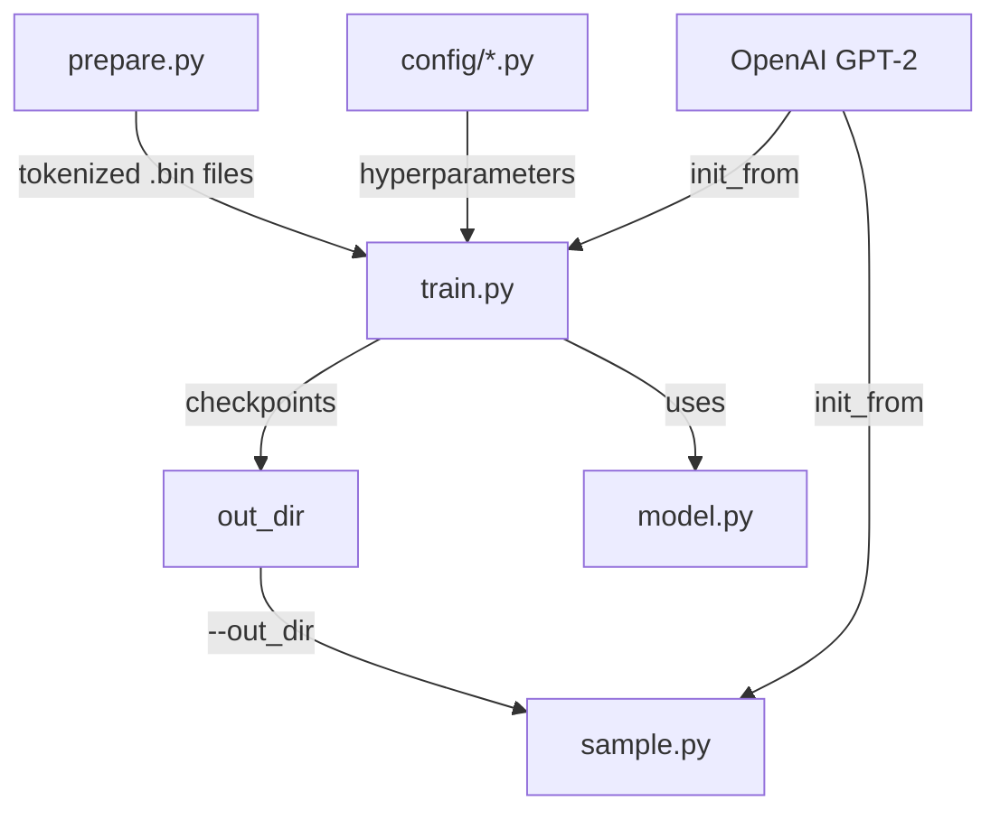

# Other — README.md

# nanoGPT — Project Overview & Developer Guide

## Status

nanoGPT is **deprecated** as of November 2025. Its successor, [nanochat](https://github.com/karpathy/nanochat), should be preferred for new work. This repository remains available for reference and posterity.

## What It Is

The simplest, fastest codebase for training and finetuning medium-sized GPT models. A rewrite of [minGPT](https://github.com/karpathy/minGPT) that prioritizes practicality over pedagogy. The entire system is two core files:

- **`train.py`** — ~300-line training loop with all boilerplate (data loading, optimization, checkpointing, logging, distributed training)
- **`model.py`** — ~300-line GPT model definition, with optional loading of OpenAI GPT-2 pretrained weights

That's the entire model + trainer. The simplicity makes it straightforward to hack, extend, and adapt.

## Architecture



### Core Components

| Component | Role |
|-----------|------|
| `model.py` | GPT model definition (Transformer blocks, attention, MLP, weight loading) |
| `train.py` | Training loop, DDP orchestration, checkpointing, evaluation, logging |
| `sample.py` | Inference script — generates text from pretrained or trained checkpoints |
| `bench.py` | Minimal benchmarking/profiling of the training step (no data loading, no logging) |
| `config/` | Python config files that override default hyperparameters |
| `data/` | Dataset preparation scripts, each in their own subdirectory |

### Data Pipeline

Each dataset lives under `data/<dataset_name>/` with a `prepare.py` script that:
1. Downloads raw text
2. Tokenizes it (character-level or BPE via `tiktoken`)
3. Writes `train.bin` and `val.bin` as flat uint16 arrays of token IDs

The training script reads these binary files directly, no PyTorch Dataset class needed.

### Configuration System

Configs are plain Python files (e.g., `config/train_shakespeare_char.py`) that define a dictionary of parameter overrides. All CLI flags in `train.py` correspond to config keys and can override them. Key parameters:

| Parameter | Description |
|-----------|-------------|
| `--device` | `cpu`, `cuda`, or `mps` (Apple Silicon GPU) |
| `--compile` | Enable `torch.compile()` (PyTorch 2.0). Default: `True` |
| `--block_size` | Context length in tokens |
| `--batch_size` | Examples per iteration |
| `--n_layer` | Number of Transformer blocks |
| `--n_head` | Number of attention heads per block |
| `--n_embd` | Embedding dimension |
| `--max_iters` | Total training iterations |
| `--lr_decay_iters` | Iterations for learning rate decay schedule |
| `--dropout` | Dropout probability |
| `--init_from` | `scratch`, `gpt2`, `gpt2-medium`, `gpt2-large`, or `gpt2-xl` |
| `--out_dir` | Directory for checkpoint writes |

## Installation

```sh
pip install torch numpy transformers datasets tiktoken wandb tqdm
```

| Dependency | Purpose |
|------------|---------|
| `torch` | Core framework (PyTorch 2.0+ recommended for `torch.compile`) |
| `numpy` | Numerical utilities |
| `transformers` | Loading OpenAI GPT-2 pretrained checkpoints |
| `datasets` | Downloading and preprocessing HuggingFace datasets (e.g., OpenWebText) |
| `tiktoken` | OpenAI's fast BPE tokenizer |
| `wandb` | Optional experiment logging |
| `tqdm` | Progress bars |

## Workflows

### 1. Train from Scratch (Character-Level, Shakespeare)

Prepare data:
```sh
python data/shakespeare_char/prepare.py
```

Train on GPU:
```sh
python train.py config/train_shakespeare_char.py
```

Default config: context 256, 384 channels, 6 layers, 6 heads. ~3 min on A100, val loss ~1.47.

Train on CPU (scaled down):
```sh
python train.py config/train_shakespeare_char.py \
    --device=cpu --compile=False --eval_iters=20 --log_interval=1 \
    --block_size=64 --batch_size=12 --n_layer=4 --n_head=4 \
    --n_embd=128 --max_iters=2000 --lr_decay_iters=2000 --dropout=0.0
```

~3 min on CPU, val loss ~1.88. On Apple Silicon, use `--device=mps` for 2–3× speedup.

Sample:
```sh
python sample.py --out_dir=out-shakespeare-char
```

### 2. Reproduce GPT-2 (124M) on OpenWebText

Prepare data:
```sh
python data/openwebtext/prepare.py
```

Train (8× A100 40GB, ~4 days):
```sh
torchrun --standalone --nproc_per_node=8 train.py config/train_gpt2.py
```

Multi-node (2 nodes example):
```sh
# Master node (IP: 123.456.123.456):
torchrun --nproc_per_node=8 --nnodes=2 --node_rank=0 \
    --master_addr=123.456.123.456 --master_port=1234 train.py
# Worker node:
torchrun --nproc_per_node=8 --nnodes=2 --node_rank=1 \
    --master_addr=123.456.123.456 --master_port=1234 train.py
```

Without Infiniband, prepend `NCCL_IB_DISABLE=1` — multinode will work but run slowly. Benchmark interconnect with `iperf3`.

Expected result: val loss ~2.85 (matches GPT-2 finetuned on OWT; the raw GPT-2 checkpoint scores ~3.11 due to domain gap with original WebText).

### 3. Finetune a Pretrained Model

Finetuning is just training with `init_from` set to a GPT-2 variant and a smaller learning rate. Example on Shakespeare with BPE tokenization:

```sh
python data/shakespeare/prepare.py
python train.py config/finetune_shakespeare.py
```

The config sets `init_from` to a GPT-2 checkpoint and reduces the learning rate. If OOM, decrease model size (`gpt2` instead of `gpt2-xl`) or reduce `block_size`.

Sample:
```sh
python sample.py --out_dir=out-shakespeare
```

### 4. Inference / Sampling

From a trained checkpoint:
```sh
python sample.py --out_dir=out-shakespeare-char
```

From an OpenAI pretrained model directly:
```sh
python sample.py \
    --init_from=gpt2-xl \
    --start="What is the answer to life, the universe, and everything?" \
    --num_samples=5 --max_new_tokens=100
```

Prompt from a file:
```sh
python sample.py --start=FILE:prompt.txt
```

## Baselines (OpenAI GPT-2 on OpenWebText)

Eval configs: `config/eval_gpt2.py`, `eval_gpt2_medium.py`, `eval_gpt2_large.py`, `eval_gpt2_xl.py`.

| Model | Params | Train Loss | Val Loss |
|-------|--------|------------|----------|
| gpt2 | 124M | 3.11 | 3.12 |
| gpt2-medium | 350M | 2.85 | 2.84 |
| gpt2-large | 774M | 2.66 | 2.67 |
| gpt2-xl | 1558M | 2.56 | 2.54 |

These are zero-shot evaluations of OpenAI's checkpoints on OWT. The domain gap between WebText (original, closed) and OpenWebText means finetuning GPT-2 on OWT drops the 124M loss from 3.12 to ~2.85 — that's the true reproduction target.

## Performance

`torch.compile()` (PyTorch 2.0) is enabled by default and provides significant speedups — e.g., iteration time drops from ~250ms to ~135ms. Use `bench.py` for isolated profiling of the training step without data loading or logging overhead.

## Troubleshooting

| Issue | Fix |
|-------|-----|
| `torch.compile` errors (Windows, older PyTorch) | Add `--compile=False` |
| Slow CPU training | Use `--device=mps` on Apple Silicon, or reduce model size / block_size / batch_size |
| OOM during finetuning | Switch to smaller `init_from` model or reduce `--block_size` |
| Slow multi-node training | Verify interconnect with `iperf3`; if no Infiniband, set `NCCL_IB_DISABLE=1` |

## Known Limitations & TODOs

- Uses DDP only — FSDP not yet integrated
- No standard zero-shot eval benchmarks (LAMBADA, HELM, etc.)
- Finetuning hyperparameters are not well-tuned
- No linear batch size warmup schedule
- Only standard positional embeddings (no rotary, ALiBi)
- Optimizer buffers are not separated from model params in checkpoints
- Limited network health logging (gradient clip events, magnitude tracking)
- Initialization strategy could be improved

## Resources

- **Video walkthrough**: [Let's build GPT: from scratch, in code, spelled out](https://www.youtube.com/watch?v=kCc8FmEb1nY) (part of the [Zero To Hero series](https://karpathy.ai/zero-to-hero.html))
- **Community**: `#nanoGPT` on [Discord](https://discord.gg/3zy8kqD9Cp)
- **Compute sponsor**: [Lambda Labs](https://lambdalabs.com)