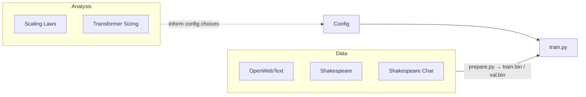

# Other

# Other — Supporting Resources

Supplementary materials for the nanoGPT training pipeline: configuration, datasets, and analysis tooling.

> **Note:** nanoGPT is **deprecated** as of November 2025. See the [project README](README.md) for details and the recommended successor.

## What's Here

This module groups everything that isn't a core training/model file but is needed to configure, feed data into, or reason about a training run.

| Category | Sub-module | Purpose |
|----------|-----------|---------|
| **Configuration** | [Config](config.md) | Python config files that define hyperparameters, evaluation settings, and runtime behavior. Consumed by `train.py` via command-line path. |
| **Datasets** | [OpenWebText](openwebtext.md) | Large-scale preprocessing for the OpenWebText corpus (open-source WebText reproduction). |
| | [Shakespeare](shakespeare.md) | Tiny Shakespeare at subword/token level — lightweight benchmark dataset (~302k train tokens). |
| | [Shakespeare Char](shakespeare_char.md) | Tiny Shakespeare at character/byte level — lightweight benchmark dataset (~1M train tokens). |
| **Analysis** | [Scaling Laws](scaling_laws.ipynb.md) | Reproduces Chinchilla scaling-law results; computes parameter counts, FLOPs, and fits L(N, D). |
| | [Transformer Sizing](transformer_sizing.ipynb.md) | Estimates parameter counts, FLOPs, checkpoint size, GPU memory, and training time from architecture hyperparameters alone. |

## How They Fit Together

The typical workflow chains these resources through `train.py`:

1. **Prepare a dataset** — run the `prepare.py` script in a data sub-module to produce `train.bin` / `val.bin` tokenized splits.
2. **Select or write a config** — pick an existing file in [Config](config.md) or create one; it sets the data path, model architecture, learning rate, and all other hyperparameters.
3. **(Optional) Size the run** — use [Transformer Sizing](transformer_sizing.ipynb.md) to estimate GPU memory and training time before committing resources, or [Scaling Laws](scaling_laws.ipynb.md) to find a compute-optimal model/data configuration.
4. **Launch training** — pass the config path to `train.py` (or `torchrun`).

The data modules and analysis notebooks are independent of each other and of the config system — they share no code. Their connection is purely at the workflow level: datasets produce the binary files that configs point to, and analysis notebooks inform the hyperparameter decisions that configs encode.