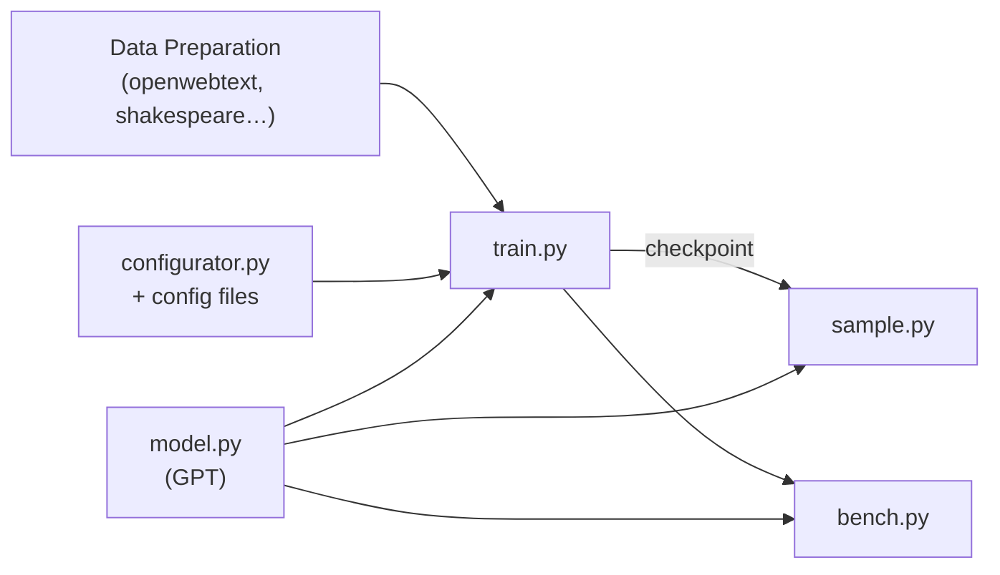

# nanoGPT — Wiki

# nanoGPT

> **⚠️ Deprecated** — nanoGPT is no longer actively maintained (as of November 2025). Its successor, [nanochat](https://github.com/karpathy/nanochat), is the recommended replacement. This repo remains available for reference.

The simplest, fastest repository for training and finetuning medium-sized GPTs. nanoGPT is a from-scratch PyTorch implementation of GPT-2 that reproduces the 124M-parameter model on OpenWebText in about four days on a single 8×A100 node. The entire codebase is roughly 600 lines: a [model definition](model-architecture.md) and a [training loop](training.md), both readable and easy to hack.

## Architecture

nanoGPT is intentionally flat — no deep package hierarchies, no abstraction layers, just a handful of scripts that each do one thing well.



**Core modules:**

- **[Model Architecture](model-architecture.md)** — The full GPT-2 network in a single file: token/position embeddings, transformer blocks, and a language modeling head. Supports training from scratch or loading pretrained GPT-2 weights from HuggingFace.
- **[Training](training.md)** — A ~300-line training loop with DDP for multi-GPU/multi-node, mixed precision, gradient accumulation, cosine LR decay, and optional `torch.compile`.
- **[Inference](inference.md)** — Autoregressive text generation from a trained or pretrained model, with temperature and top-k sampling.
- **[Benchmarking](benchmarking.md)** — A stripped-down loop that measures time-per-iteration and MFU (Model FLOPs Utilization) for hardware or code-change validation.
- **[Data Preparation](data-preparation.md)** — Scripts that convert raw text (OpenWebText, Shakespeare, etc.) into memory-mapped binary files for efficient random access at training time.
- **[Configuration Utility](configuration-utility.md)** — A minimalist convention-over-configuration system that applies Python config files or CLI key-value overrides directly into the caller's global scope.

Supporting resources — config presets, dataset references, and analysis tooling — are documented in [Other](other.md).

## End-to-End Flows

**Training a model from scratch:**

1. **Prepare data** — Run a [Data Preparation](data-preparation.md) script on your raw text to produce `train.bin` and `val.bin`.
2. **Configure** — Either edit a config file under `config/` or pass CLI overrides, processed by the [Configuration Utility](configuration-utility.md).
3. **Train** — Launch `train.py` (single GPU for debugging, or `torchrun` for multi-GPU). The [Model Architecture](model-architecture.md) is instantiated, trained, and checkpointed to `out_dir/ckpt.pt`.
4. **Benchmark** — Optionally run `bench.py` to verify throughput and MFU before committing to a long run.

**Generating text from a trained model:**

1. **Load** — `sample.py` reads a checkpoint (or loads a pretrained GPT-2 variant directly via `init_from=gpt2-*`).
2. **Tokenize prompt** — The tokenizer is resolved automatically from checkpoint metadata.
3. **Sample** — Autoregressive generation with configurable temperature and top-k filtering. See [Inference](inference.md) for details.

## Quick Start

```bash
# Clone and enter the repo
git clone https://github.com/karpathy/nanoGPT.git
cd nanoGPT

# Install dependencies
pip install torch numpy transformers datasets tiktoken wandb

# Prepare a tiny dataset (Shakespeare, ~1 MB)
cd data/shakespeare && python prepare.py && cd ../..

# Train on a single GPU (debug-friendly defaults)
python train.py config/train_shakespeare_char.py

# Generate text from the trained model
python sample.py --out_dir=out-shakespeare-char
```

For multi-GPU training, use `torchrun`:

```bash
torchrun --nproc_per_node=8 train.py config/train_gpt2.py
```

Full configuration options and preset files are covered in [Training](training.md) and [Configuration Utility](configuration-utility.md).