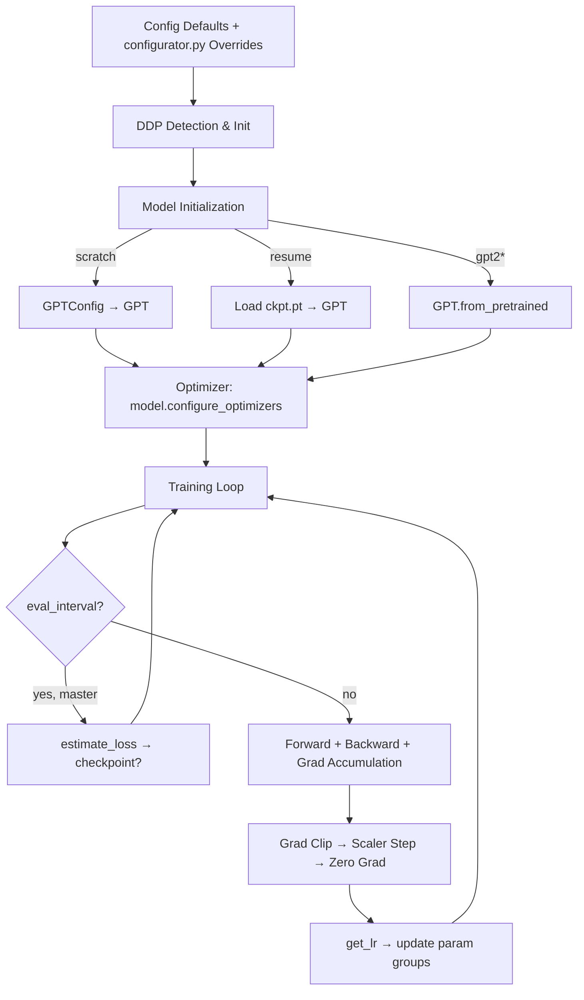
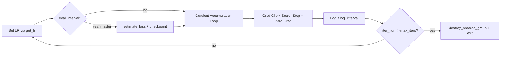

# Training

# Training Module

## Overview

`train.py` is the main training entry point for GPT language models. It supports single-GPU debugging, multi-GPU single-node training, and multi-node distributed training via PyTorch's `torchrun` launcher and `DistributedDataParallel` (DDP). The script trains a GPT-2–scale model (124M parameters by default) on the OpenWebText dataset using mixed precision, gradient accumulation, cosine learning rate decay, and optional `torch.compile` optimization.

## Quick Start

```bash
# Single GPU (debug mode)
python train.py --batch_size=32 --compile=False

# DDP on 4 GPUs, 1 node
torchrun --standalone --nproc_per_node=4 train.py

# DDP on 8 GPUs across 2 nodes
# Master node (IP 123.456.123.456):
torchrun --nproc_per_node=8 --nnodes=2 --node_rank=0 \
  --master_addr=123.456.123.456 --master_port=1234 train.py
# Worker node:
torchrun --nproc_per_node=8 --nnodes=2 --node_rank=1 \
  --master_addr=123.456.123.456 --master_port=1234 train.py
```

If your cluster lacks Infiniband, prepend `NCCL_IB_DISABLE=1`.

## Architecture



## Configuration

All configuration is defined as module-level variables at the top of `train.py`. These defaults are designed for training GPT-2 (124M) on OpenWebText. The script executes `configurator.py` via `exec()`, which can override any value from the command line or a config file. The full set of overridden values is captured in the `config` dict for logging.

### Configuration Groups

| Group | Key | Default | Description |
|------|-----|---------|-------------|
| **I/O** | `out_dir` | `'out'` | Directory for checkpoints |
| | `eval_interval` | `2000` | Steps between evaluations |
| | `log_interval` | `1` | Steps between training log lines |
| | `eval_iters` | `200` | Batches to average over during evaluation |
| | `eval_only` | `False` | Exit after first evaluation |
| | `always_save_checkpoint` | `True` | Save checkpoint every eval, not just on improvement |
| | `init_from` | `'scratch'` | Initialization mode: `'scratch'`, `'resume'`, or `'gpt2*'` |
| **WandB** | `wandb_log` | `False` | Enable Weights & Biases logging |
| | `wandb_project` | `'owt''` | WandB project name |
| | `wandb_run_name` | `'gpt2'` | WandB run name |
| **Data** | `dataset` | `'openwebtext'` | Dataset name (subdirectory under `data/`) |
| | `gradient_accumulation_steps` | `40` | Micro-steps before optimizer update (5×8) |
| | `batch_size` | `12` | Micro-batch size per forward pass |
| | `block_size` | `1024` | Context length in tokens |
| **Model** | `n_layer` | `12` | Transformer layers |
| | `n_head` | `12` | Attention heads |
| | `n_embd` | `768` | Embedding dimension |
| | `dropout` | `0.0` | Dropout rate (0 for pretraining, 0.1+ for finetuning) |
| | `bias` | `False` | Bias in LayerNorm and Linear layers |
| **Optimizer** | `learning_rate` | `6e-4` | Peak learning rate |
| | `max_iters` | `600000` | Total training iterations |
| | `weight_decay` | `1e-1` | AdamW weight decay |
| | `beta1` | `0.9` | Adam beta1 |
| | `beta2` | `0.95` | Adam beta2 |
| | `grad_clip` | `1.0` | Gradient norm clipping (0 to disable) |
| **LR Schedule** | `decay_lr` | `True` | Enable cosine decay |
| | `warmup_iters` | `2000` | Linear warmup steps |
| | `lr_decay_iters` | `600000` | Total decay steps (≈ `max_iters` per Chinchilla) |
| | `min_lr` | `6e-5` | Floor learning rate (≈ `learning_rate/10`) |
| **DDP** | `backend` | `'nccl'` | Distributed backend |
| **System** | `device` | `'cuda'` | Device string |
| | `dtype` | `'bfloat16'` or `'float16'` | Auto-selected based on GPU support |
| | `compile` | `True` | Use `torch.compile` (PyTorch 2.0+) |

### Derived Values

After configuration is loaded, several derived values are computed:

- **`tokens_per_iter`** = `gradient_accumulation_steps × ddp_world_size × batch_size × block_size` — total tokens processed per optimizer step.
- **`master_process`** — `True` on rank 0 (DDP) or single-GPU; this process handles logging and checkpointing.
- **`gradient_accumulation_steps`** is divided by `ddp_world_size` in DDP mode (must divide evenly).
- **`ptdtype`** — resolved `torch.dtype` from the `dtype` string.
- **`ctx`** — `torch.amp.autocast` context manager for mixed precision (or `nullcontext` on CPU).

## Distributed Training (DDP)

The script auto-detects DDP mode by checking for the `RANK` environment variable (set by `torchrun`):

```python
ddp = int(os.environ.get('RANK', -1)) != -1
```

When DDP is active:

1. `init_process_group(backend=backend)` initializes the process group.
2. Each process binds to its GPU via `torch.cuda.set_device(f'cuda:{ddp_local_rank}')`.
3. `gradient_accumulation_steps` is divided by `ddp_world_size` so the effective global batch size remains constant.
4. Gradient synchronization is deferred to the last micro-step within each accumulation cycle by toggling `model.require_backward_grad_sync`, avoiding redundant all-reduce operations.
5. After training, `destroy_process_group()` cleans up.

Only the **master process** (rank 0) performs evaluation, logging, and checkpoint writes.

## Data Loading

Data is loaded from memory-mapped binary files under `data/{dataset}/`:

- `train.bin` — training split, stored as `uint16` tokens
- `val.bin` — validation split, stored as `uint16` tokens
- `meta.pkl` — optional metadata file containing `vocab_size`

### `get_batch(split)`

Returns a batch of `(x, y)` token tensors for the given split.

- Recreates `np.memmap` on every call to avoid a [known memory leak](https://stackoverflow.com/questions/45132940/numpy-memmap-memory-usage-want-to-iterate-once/61472122#61472122).
- Samples `batch_size` random starting positions, each of length `block_size`.
- `x` = tokens at positions `[i : i+block_size]`, `y` = tokens at `[i+1 : i+1+block_size]` (next-token prediction).
- On CUDA, tensors are pinned and transferred asynchronously (`non_blocking=True`).

Vocab size is derived from `meta.pkl` if present; otherwise defaults to 50304 (GPT-2's 50257 rounded up for GPU efficiency).

## Model Initialization

Three initialization modes are controlled by `init_from`:

### `init_from = 'scratch'`

Creates a new `GPT` from a `GPTConfig` built from the command-line model args. If no `meta.pkl` is found, `vocab_size` defaults to 50304.

### `init_from = 'resume'`

Loads a checkpoint from `{out_dir}/ckpt.pt`. The checkpoint must contain:

| Key | Contents |
|-----|----------|
| `model` | Model `state_dict` |
| `optimizer` | Optimizer `state_dict` |
| `model_args` | Dict of model config used at training time |
| `iter_num` | Iteration count at save time |
| `best_val_loss` | Best validation loss at save time |
| `config` | Full training config dict |

Architectural parameters (`n_layer`, `n_head`, `n_embd`, `block_size`, `bias`, `vocab_size`) are **forced** to match the checkpoint's `model_args` to ensure weight compatibility. Other parameters (e.g., `dropout`) retain their command-line values.

The loader strips any `_orig_mod.` prefix from state dict keys (an artifact of `torch.compile`).

### `init_from = 'gpt2*'` (e.g., `'gpt2'`, `'gpt2-medium'`)

Loads pretrained OpenAI GPT-2 weights via `GPT.from_pretrained(init_from, override_args)`. The `dropout` value from the command line is passed as an override. Model config attributes are read back from the loaded model to ensure checkpoint consistency.

### Block Size Surgery

If the configured `block_size` is smaller than the model's native context length, `model.crop_block_size(block_size)` performs model surgery to truncate the positional embeddings, and `model_args['block_size']` is updated accordingly.

## Optimizer

The optimizer is created by the model itself:

```python
optimizer = model.configure_optimizers(weight_decay, learning_rate, (beta1, beta2), device_type)
```

When resuming, the optimizer state is restored from the checkpoint. The checkpoint variable is then set to `None` to free memory.

## Mixed Precision

The `dtype` setting controls precision:

- **`bfloat16`** — used if the GPU supports BF16. No `GradScaler` needed.
- **`float16`** — fallback. A `torch.cuda.amp.GradScaler` is enabled to prevent underflow.
- **`float32`** — full precision. Scaler is a no-op.

The autocast context `ctx` wraps forward passes. TF32 is enabled on both matmul and cuDNN for additional throughput on Ampere+ GPUs.

## Learning Rate Schedule

### `get_lr(it)`

Implements cosine decay with linear warmup:

1. **Warmup** (`it < warmup_iters`): Linear ramp from 0 to `learning_rate`.
2. **Decay** (`warmup_iters ≤ it ≤ lr_decay_iters`): Cosine decay from `learning_rate` down to `min_lr`.
3. **Floor** (`it > lr_decay_iters`): Returns `min_lr`.

If `decay_lr` is `False`, the learning rate stays fixed at `learning_rate`.

The learning rate is set per-iteration by updating `param_group['lr']` directly on the optimizer's param groups.

## Evaluation

### `estimate_loss()`

Called every `eval_interval` steps on the master process. Averages loss over `eval_iters` batches for both `train` and `val` splits under `@torch.no_grad()` and `model.eval()`. Returns a dict `{'train': float, 'val': float}`.

## Training Loop

The main loop runs until `iter_num > max_iters`:



### Gradient Accumulation

Each optimizer step consists of `gradient_accumulation_steps` micro-steps:

1. Forward pass under autocast (`ctx`).
2. Loss is divided by `gradient_accumulation_steps` so gradients accumulate correctly.
3. The next batch is prefetched asynchronously during the forward pass.
4. In DDP mode, `model.require_backward_grad_sync` is set to `True` only on the last micro-step, deferring the all-reduce.
5. `scaler.scale(loss).backward()` computes gradients (with scaling for fp16).

After accumulation:

- Gradients are unscaled and clipped to `grad_clip` (if non-zero).
- `scaler.step(optimizer)` applies the update.
- `scaler.update()` adjusts the scale factor.
- `optimizer.zero_grad(set_to_none=True)` frees gradient memory immediately.

### Checkpointing

A checkpoint is saved when:

- Validation loss improves (`losses['val'] < best_val_loss`), **or**
- `always_save_checkpoint` is `True`.

Checkpoints are **not** saved at iteration 0. The saved dict contains the unwrapped model state (`raw_model.state_dict()`), optimizer state, model args, iteration number, best val loss, and the full config.

### Model FLOPs Utilization (MFU)

After the first 5 local iterations (to let the pipeline settle), `raw_model.estimate_mfu(batch_size * gradient_accumulation_steps, dt)` estimates hardware utilization. The reported `running_mfu` is an exponential moving average (α=0.1) smoothed over iterations.

### WandB Logging

When `wandb_log` is `True` and this is the master process, the script logs iteration number, train/val loss, learning rate, and MFU to Weights & Biases at each evaluation.

## Dependencies on Other Modules

| Module | Usage |
|--------|-------|
| `model.GPTConfig` | Configuration dataclass for model architecture |
| `model.GPT` | The transformer model class; `__call__` returns `(logits, loss)` |
| `model.GPT.from_pretrained` | Class method to load OpenAI GPT-2 pretrained weights |
| `model.GPT.crop_block_size` | Truncates positional embeddings for shorter context |
| `model.GPT.configure_optimizers` | Creates the AdamW optimizer with weight decay grouping |
| `model.GPT.estimate_mfu` | Estimates model FLOPs utilization given batch size and time |
| `configurator.py` | Executed at import time to override config from CLI/config file |

## Key Design Decisions

- **Memmap re-creation per batch**: Avoids a memory leak in numpy's memmap implementation at the cost of minor overhead.
- **Async batch prefetching**: `get_batch('train')` is called immediately after the forward pass, overlapping data transfer with the backward pass.
- **Gradient sync control via `require_backward_grad_sync`**: Avoids the verbosity of the `model.no_sync()` context manager while achieving the same result — gradients are only all-reduced on the final micro-step.
- **`set_to_none=True` in `zero_grad`**: Frees gradient tensor memory immediately rather than zeroing in-place.
- **Checkpoint key prefix stripping**: Handles the `_orig_mod.` prefix that `torch.compile` sometimes injects into state dict keys.