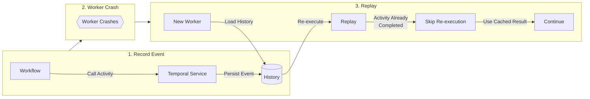
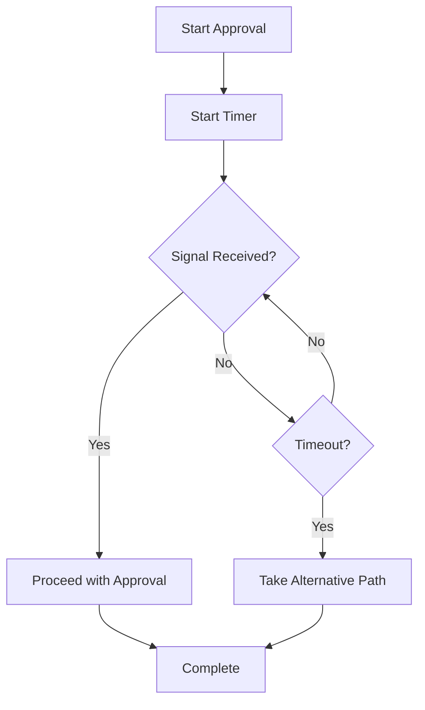
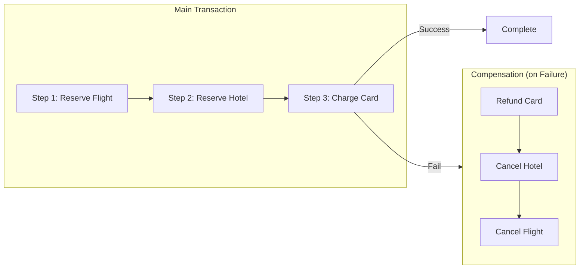

# From Temporal Primitives to Design Patterns

**Source:** YouTube (Temporal Channel) | **Duration:** 10:39

A three-part video explaining how Temporal simplifies distributed systems, walks through its core primitives, and demonstrates real-world design patterns. A virtual intro session with a Temporal Solution Architect.

## The Problem Temporal Solves

Modern business processes (e.g., order processing) involve sequences of steps interacting with external services (inventory, payment, shipping). Handling failures requires implementing retries, queues, state management, and cron jobs across services. This architecture is complex and vulnerable to:

- Unexpected process restarts
- Dropped network connections
- Insufficient system capacity
- Infrastructure failures
- External service outages

> "Temporal abstracts away the complexity of building modern applications by shielding you from the complexities of distributed systems."

### Key Benefits

- Built-in support for retries, timeouts, and state management
- **"It's just code, not YAML, not JSON, not flowcharts, actual code."**
- True polyglot development (SDKs for multiple languages; combinable in the same app)
- Easier migration: teams can reuse current code and incrementally adopt Temporal

---

## Core Temporal Primitives

### 1. Activity

Wraps a function call interacting with another system (e.g., an API request).

- **Tracking & Persistence:** Temporal tracks how it was called, when/where it ran, and its return value
- **Customizable Retries:** Automatically retries upon failure based on your specified timing and number of retries
- **Non-retryable Errors:** You can specify errors that should *not* be retried (e.g., charge failed due to an expired credit card)

### 2. Workflow

A function that orchestrates steps (which can be Activities).

- **Durable Execution:** Workflows are crash-proof. If the entire process crashes, application state is durable—variables retain values, no data is lost, and completed activities are not repeated

> "From the developer perspective, it's as if the crash never even happened."

Additional capabilities: Queueing, job scheduling, retries, and observability.

#### How Durable Execution Works

1. Temporal service records events (function called, input data) durably
2. If a worker crashes, a new worker retrieves state and *replays* the deterministic, side-effect-free workflow code
3. When replay reaches an activity call, it checks history: if already completed, it assigns the previous return value without re-executing
4. Recovery is complete when it reaches a call with no event history entry, and execution continues

### 3. Durable Timer

Enables reliable delays (e.g., `sleep` for 1 day between steps).

- The worker requests the service to start a timer and pauses the workflow to save resources
- The timer reliably fires regardless of application restarts
- The service instructs the worker to resume when time elapses

### 4. Signal & Await

Enables workflows to wait for external input.

- **`await`**: Blocks workflow execution until a condition is met (e.g., `approved == true`)
- **Signal**: An external user/system sends a signal to the Temporal service, which delivers it to the worker, invoking a handler to update the variable and unblock the `await`

Other primitives: Query, Update, Child Workflow

---

## Design Patterns

### 1. Time-Boxed Approval

Uses a wait with a time limit to wait for a signal.

- **If signal arrives:** Workflow proceeds
- **If time limit expires:** Workflow takes a different path
- *Benefit:* Ensures the workflow won't block indefinitely

### 2. Resumable Activity

Solves the problem of activities failing due to invalid data (which standard retries cannot fix).

- **Mechanism:** Wraps the activity in a loop. On permanent failure, it pauses using `workflow await`
- **Roll Forward:** Instead of failing the whole workflow or rolling backward, an administrator inspects the state, identifies the correction, and sends a signal to retry the activity (optionally updating the input data)
- Once corrected, the activity completes and the workflow continues

### 3. Saga Pattern

Addresses the need to undo completed steps during a multi-step process when a later step fails. Uses compensating transactions to reverse previously completed work, providing consistency without traditional two-phase commits.

**Saga Execution Flow (Trip Booking Example):**

1. **Initialize:** Create a stack to hold compensation logic
2. **Step 1:** Push `cancel flight` to stack → Reserve flight (Success)
3. **Step 2:** Push `cancel hotel` to stack → Reserve hotel (Success)
4. **Step 3:** Push `refund payment` to stack → Charge card (**Fails**)
5. **Compensation (Catch Block):** Iterate through the stack from the last successful step, executing compensation actions

---

## Related

- [[workflow]] - Durable orchestration code
- [[activity]] - Retryable side-effecting work
- [[durable-execution]] - The execution model
- [[compensation]] - Handling partial failures with Saga pattern
- [[replay]] - Workflow state reconstruction